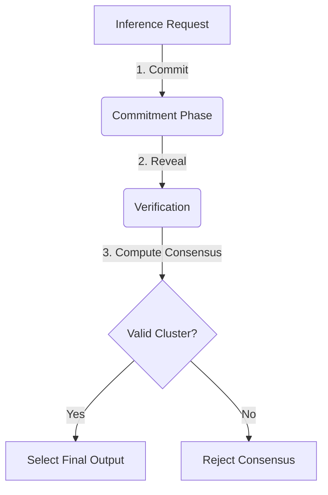

import { Callout, Steps, Step } from "nextra-theme-docs";

# Consensus Mechanism

The consensus mechanism employed by Rakis is a crucial component that ensures the integrity and consistency of the decentralized inference process. It addresses the inherent non-deterministic nature of large language models and provides a means to achieve agreement on inference outputs across the network.

## Embedding-based Consensus

At the core of the consensus mechanism is the use of embeddings. Embeddings are mathematical representations of text that capture its semantic meaning. In Rakis, the outputs of inference requests are converted into embeddings using a dedicated embedding model. These embeddings are then compared to determine their similarity.

<Callout>
The embedding model used in Rakis is the `nomic-ai/nomic-embed-text-v1.5` model, which has been observed to produce relatively deterministic embeddings. However, the architecture allows for the integration of other embedding models as well.
</Callout>

## Adjustable Security Bindings

Rakis employs an adjustable security framework that allows applications with varying security and determinism requirements to define the consensus parameters that best suit their needs. The security frame consists of the following parameters:

- **Quorum Size**: The number of different nodes that need to run the inference for it to be considered valid.
- **SecDistance**: The maximum distance in embedding space within which inference outputs are considered similar.
- **SecPercentage**: The percentage of the quorum that needs to fall within the specified `SecDistance` for the consensus to be achieved.

By adjusting these parameters, applications can strike the desired balance between security, determinism, and computational efficiency.

## Commit-Reveal System

Rakis employs a commit-reveal system to ensure the integrity of the consensus process. When an inference request is initiated, participating nodes commit to their respective inference outputs by sharing a hash of their results, called the `bEmbeddingHash`. This locks them into a specific output without revealing it to others, preventing potential copying or collusion.

Once the commitment phase is complete and sufficient commitments have been received (as specified by the `Quorum Size`), a reveal phase is initiated. During this phase, nodes reveal their actual inference outputs, embeddings, and `bEmbeddings`.

<Steps>

### Step 1: Verification

The revealed outputs are verified against the committed hashes to ensure consistency and prevent malicious behavior.

### Step 2: Consensus Computation

Rakis then computes the consensus by finding the cluster of embeddings in high-dimensional space that satisfies the `SecDistance` and `SecPercentage` criteria. Any outliers or invalid outputs are rejected through this process.

</Steps>

The final consensus output is deterministically selected from the valid cluster using the joint hash of all valid outputs as a source of randomness.

## Clustering Algorithm

The consensus mechanism in Rakis currently employs a simple clustering algorithm to identify the valid cluster of embeddings. It computes the pairwise distances between all embeddings and identifies the largest cluster that satisfies the `SecDistance` and `SecPercentage` criteria.

While this approach is functional, Rakis is designed to be extensible, and more advanced clustering algorithms can be integrated. Potential alternatives include [DBSCAN](https://en.wikipedia.org/wiki/DBSCAN) and other density-based or hierarchical clustering methods, which may improve the consensus process's robustness and efficiency.

The consensus mechanism in Rakis is designed to be adjustable, secure, and extensible, enabling various applications to leverage decentralized inference while meeting their specific requirements for security, determinism, and computational efficiency.

<Callout>
While the current implementation provides a functional consensus mechanism, Rakis is an actively developed project, and improvements to the consensus algorithm are planned for future releases. Contributions and feedback from the community are welcomed to further enhance the robustness and efficiency of the consensus process.
</Callout>