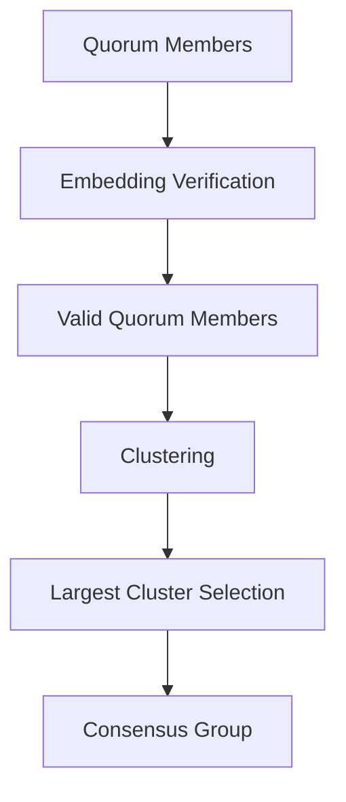

import { Callout, Steps, Step } from "nextra-theme-docs";

# Distributed Consensus

Rakis achieves distributed consensus for inference results through a novel consensus protocol inspired by the Byzantine Fault Tolerance (BFT) algorithm. The protocol is designed to ensure that a single, consistent inference result emerges even in the presence of faulty or malicious nodes.

<Callout>
The distributed consensus mechanism is a critical component of Rakis, as it allows the network to function without a centralized authority or trusted third party. By leveraging the collective computational power of the network, Rakis can produce reliable and trustworthy inference results.
</Callout>

## The Consensus Protocol

The Rakis consensus protocol follows these steps:

<Steps>

### Step 1

1. A user submits an inference request to the network, specifying the prompt, security parameters (such as the desired quorum size and embedding distance threshold), and accepted language models.

### Step 2

2. The request is propagated across the network, and nodes that are capable of processing the request (based on the accepted language models) generate their inference results independently.

### Step 3

3. Each node computes a binary embedding hash (`bEmbeddingHash`) of its inference result using a specified embedding model. The `bEmbeddingHash` represents a compact and consistent representation of the inference result.

### Step 4

4. Nodes broadcast their `bEmbeddingHash` values to the network, forming a quorum of commitments.

### Step 5

5. Once the quorum threshold (specified in the original request) is reached, nodes reveal their full inference results and embeddings to the network.

### Step 6

6. Each node verifies the received embeddings against the previously committed `bEmbeddingHash` values. Nodes that fail this verification are discarded from the quorum.

### Step 7

7. The remaining valid quorum members are clustered based on the embedding distance between their inference results. The cluster with the largest size (and above the security threshold) is selected as the consensus group.

### Step 8

8. Within the consensus group, a single inference result is deterministically selected based on a hash function applied to the clustered inference results. This selected inference is considered the final, agreed-upon result for the original request.

</Steps>

The consensus protocol leverages the following key components:

- **Quorum Formation**: The quorum size is specified in the original inference request and represents the minimum number of nodes needed to reach consensus.
- **Embedding Verification**: Binary embeddings (`bEmbeddings`) are used to efficiently verify the integrity of inference results, discarding invalid or tampered results.
- **Clustering and Consensus Selection**: The clustering process identifies the largest group of nodes with similar inference results (within the specified embedding distance threshold). A deterministic function then selects the final consensus result from this group.

<Callout>
The use of binary embeddings, quorum formation, and clustering techniques allows Rakis to achieve distributed consensus in a decentralized and trustless manner, without relying on a centralized authority or trusted third party.
</Callout>

## Quorum Management

The quorum management process in Rakis is handled by the [QuorumDB](/inference-db/inference-db-quorum-db) component. It is responsible for tracking the state of inference quorums, coordinating the reveal process, and triggering the consensus verification phase.

<Callout>
The QuorumDB plays a crucial role in the consensus protocol, ensuring that the quorum formation, reveal, and consensus verification stages proceed smoothly and in a timely manner.
</Callout>

Here's a high-level overview of the quorum management process:

1. When a new inference request is received, the QuorumDB creates a new quorum entry with the specified parameters (quorum threshold, embedding model, etc.).
2. As nodes submit their `bEmbeddingHash` commitments, the QuorumDB tracks the quorum progress and determines when the quorum threshold is reached.
3. Once the quorum threshold is met, the QuorumDB initiates the reveal phase by broadcasting reveal requests to the participating nodes.
4. Nodes respond by revealing their full inference results and embeddings, which the QuorumDB verifies against the committed `bEmbeddingHash` values.
5. After the reveal phase, the QuorumDB marks the quorum as ready for consensus verification and notifies the [InferenceDB](/inference-db) to begin the consensus process.

The QuorumDB also handles timeouts and failures during the quorum formation and reveal phases, marking quorums as failed if the required thresholds are not met within the specified time window.

## Embedding Verification

Embedding verification is a critical step in the Rakis consensus protocol, ensuring the integrity of inference results and preventing malicious or tampered data from influencing the consensus process.

The verification process works as follows:

1. Each node computes a binary embedding (`bEmbedding`) of its inference result using a specified embedding model (e.g., `nomic-ai/nomic-embed-text-v1.5`).
2. The node then computes a hash of the binary embedding, resulting in the `bEmbeddingHash`.
3. The `bEmbeddingHash` is broadcast to the network as part of the quorum formation process.
4. During the reveal phase, nodes reveal their full inference results and `bEmbeddings`.
5. Other nodes in the quorum verify that the revealed `bEmbedding` matches the previously committed `bEmbeddingHash`.

```python
# Example code for computing bEmbeddingHash
import hashlib

def hash_binary_embedding(binary_embedding):
    byte_array = bytearray(binary_embedding)
    return hashlib.sha256(byte_array).hexdigest()

def compute_bEmbeddingHash(inference_result):
    embedding = embed_text(inference_result)
    binary_embedding = quantize_embedding(embedding)
    bEmbeddingHash = hash_binary_embedding(binary_embedding)
    return bEmbeddingHash
```

Nodes that fail the embedding verification are discarded from the quorum, ensuring that only valid and consistent inference results are considered during the consensus selection process.

<Callout>
The use of binary embeddings and their hashes (`bEmbeddingHash`) provides a compact and efficient way to represent and verify inference results, reducing the network overhead and computational cost of the consensus process.
</Callout>

## Consensus Selection

After the embedding verification process, the remaining valid quorum members are clustered based on the embedding distance between their inference results. The cluster with the largest size (and above the security threshold specified in the original request) is selected as the consensus group.



Within the consensus group, a deterministic function is applied to select the final, agreed-upon inference result. This function typically involves hashing the clustered inference results and using the hash value to deterministically select one of the results.

```python
# Example code for deterministic consensus selection
import hashlib

def select_consensus_result(valid_inferences):
    # Concatenate inference results and compute a joint hash
    joint_hash = hashlib.sha256(''.join(sorted(valid_inferences)).encode()).hexdigest()
    
    # Use the joint hash to deterministically select a result
    selected_index = int(joint_hash[:16], 16) % len(valid_inferences)
    consensus_result = valid_inferences[selected_index]
    
    return consensus_result
```

By leveraging the clustering and deterministic selection processes, Rakis ensures that the final consensus result is consistent across the network and represents the majority opinion of the valid quorum members.

<Callout>
The consensus selection mechanism in Rakis is designed to be decentralized, deterministic, and resistant to manipulation or collusion attacks, ensuring the integrity and trustworthiness of the inference results produced by the network.
</Callout>

[Next: Inference DB →](/inference-db)