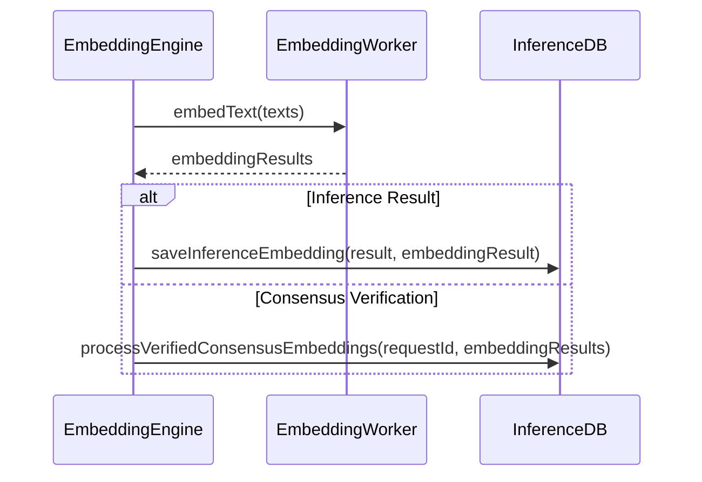

import { Callout, Steps, Step } from "nextra-theme-docs";

# Embedding Engine

The Embedding Engine in Rakis is responsible for managing the embedding process for text inputs. It handles the worker management, embedding queue processing, and supports different embedding models. The Embedding Engine is used for two main purposes:

1. **Embedding Inference Results**: When an inference is completed, the output text needs to be embedded into a numerical representation for consensus verification and comparison.

2. **Consensus Verification**: During the consensus process, the output texts from various peers need to be embedded and compared to verify the consistency and accuracy of the results.

## Worker Management

The Embedding Engine utilizes a worker-based architecture to handle the embedding process. Each worker is dedicated to a specific embedding model and can handle embedding requests concurrently.

<Steps>

### Step 1: Initializing Workers

When the Rakis Domain is initialized, the Embedding Engine is configured with the desired number of workers for each supported embedding model. The `scaleEmbeddingWorkers` function is used to create and initialize the workers:

```typescript
await embeddingEngine.scaleEmbeddingWorkers(
  "nomic-ai/nomic-embed-text-v1.5", // Embedding model name
  2 // Number of workers
);
```

### Step 2: Adding and Removing Workers

The `addEmbeddingWorker` and `deleteEmbeddingWorker` functions are used to dynamically add or remove workers as needed. These functions can be called at runtime to adjust the number of workers based on the embedding workload.

</Steps>

### Worker Lifecycle

Each embedding worker manages its own lifecycle, including loading the embedding model, handling embedding requests, and reporting its status. The worker communicates with the Embedding Engine through message passing, allowing for concurrent and asynchronous processing.

## Embedding Queue Processing

The Embedding Engine maintains a queue of embedding requests, which can be either inference results or consensus verification requests. The queue is prioritized based on the following criteria:

1. **Consensus Verification Requests with Contributions**: Requests for consensus verification where the local node has contributed an inference are given the highest priority.
2. **Inference Result Requests**: Requests for embedding inference results are prioritized next.
3. **Other Consensus Verification Requests**: Requests for consensus verification without local contributions are given the lowest priority.

Within each priority level, requests are sorted by their expiration time, with the soonest expiring requests being processed first.

### Queue Processing

When an embedding worker becomes available, the Embedding Engine assigns the next embedding request from the queue to the worker. The worker then processes the request and returns the embedding results. The Embedding Engine handles the results accordingly, either by storing the inference embedding or passing the consensus verification embeddings to the Inference DB for further processing.



## Embedding Model Support

The Embedding Engine supports multiple embedding models, allowing for flexibility and the ability to choose the most suitable model for a given use case. The `availableEmbeddingModels` constant in the [types.ts](/embedding-engine/embedding-engine-types) file lists the supported models.

<Callout emoji="💡">
Adding support for a new embedding model involves updating the `availableEmbeddingModels` constant and potentially providing custom logic for loading and configuring the model in the worker.
</Callout>

### Example: Adding a New Embedding Model

Let's say you want to add support for the "new-awesome-embedder" model. Here are the steps you'd follow:

1. Update the `availableEmbeddingModels` constant in [types.ts](/embedding-engine/embedding-engine-types):

```typescript
export const availableEmbeddingModels = [
  "nomic-ai/nomic-embed-text-v1.5",
  "new-awesome-embedder", // Add the new model here
] as const;
```

2. In the [embedding-worker.ts](/embedding-engine/embedding-worker) file, update the `loadEmbeddingWorker` function to handle the new model:

```typescript
async function loadEmbeddingWorker(modelName: EmbeddingModelName, workerId: string) {
  try {
    // ... existing code ...

    if (modelName === "new-awesome-embedder") {
      // Custom logic to load and configure the "new-awesome-embedder" model
      workerInstance!.pipeline = await loadNewAwesomeEmbedder();
    }

    // ... existing code ...
  } catch (err) {
    // ... error handling ...
  }
}
```

3. Implement the `loadNewAwesomeEmbedder` function to load and configure the new model based on its specific requirements.

By following these steps, you can easily extend the Embedding Engine to support additional embedding models as needed.

## Performance and Scaling

The Embedding Engine is designed to handle a high volume of embedding requests efficiently. It achieves this through worker scaling and queue prioritization.

### Worker Scaling

The number of workers for each embedding model can be dynamically adjusted based on the workload. This allows the Embedding Engine to scale up or down as needed, optimizing resource utilization and ensuring timely processing of embedding requests.

### Queue Prioritization

By prioritizing the embedding queue based on the request type and expiration time, the Embedding Engine ensures that critical requests are processed first, minimizing the risk of missed deadlines or consensus failures.

## Logging and Monitoring

The Embedding Engine logs important events and metrics, such as worker status changes, embedding progress, and errors. These logs can be used for monitoring and troubleshooting purposes, providing insights into the embedding process and identifying potential bottlenecks or issues.

Additionally, the Embedding Engine emits events that can be subscribed to by other components, enabling real-time monitoring and integration with external monitoring systems.