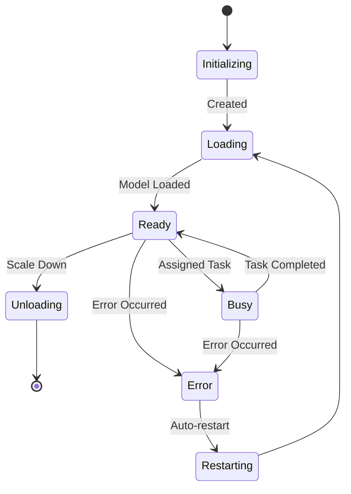

import { Callout, Steps, Step } from "nextra-theme-docs";

# LLM Engine

The LLM Engine is the core component of Rakis responsible for managing language model inference tasks. It handles the loading, scaling, and execution of inference tasks across multiple workers and models.

## Overview

The LLM Engine is built around the `LLMEngine` class, which serves as the central point for managing language model workers and processing inference requests. It provides a unified interface for interacting with various language models and enables efficient utilization of available resources.

The key responsibilities of the LLM Engine include:

- **Worker Management**: The LLM Engine handles the creation, scaling, and termination of language model workers. It dynamically adjusts the number of workers based on the workload and available resources.
- **Inference Task Processing**: Inference requests are received and distributed across available workers, ensuring efficient utilization of resources and load balancing.
- **Model Support**: The LLM Engine supports a wide range of language models, enabling users to leverage the most suitable model for their needs.
- **Scaling and Load Balancing**: The engine automatically scales the number of workers based on demand, ensuring optimal performance and resource utilization.

## Architecture

The LLM Engine follows a modular architecture, separating concerns and enabling easy extensibility. The core components of the LLM Engine architecture are:

1. **LLMEngine**: The central class that manages the overall lifecycle of language model workers and handles inference requests.
2. **LLMWorker**: Represents an individual worker responsible for executing inference tasks using a specific language model.
3. **MLCEngine**: A wrapper around the `@mlc-ai/web-llm` library, which provides the underlying language model capabilities.



The `LLMEngine` class orchestrates the creation and management of `LLMWorker` instances. Each `LLMWorker` encapsulates a specific language model and handles inference tasks for that model. The `MLCEngine` class acts as a bridge between the `LLMWorker` and the underlying language model API provided by the `@mlc-ai/web-llm` library.

## Key Features

### Worker Management

The LLM Engine provides a robust worker management system that enables dynamic scaling of language model workers based on demand. The `scaleLLMWorkers` method allows you to specify the desired number of workers for a particular language model, and the engine automatically handles the creation or termination of workers as needed.

<Callout>
  The LLM Engine automatically scales the number of workers based on the
  workload, ensuring efficient resource utilization and optimal performance.
</Callout>

### Inference Task Processing

The `runInference` and `runInferenceNonStreaming` methods of the `LLMEngine` class enable you to submit inference requests to available workers. The engine intelligently distributes the requests across available workers, ensuring load balancing and efficient resource utilization.

```typescript
const response = await engine.runInferenceNonStreaming({
  modelName: "gemma-2b-it-q4f16_1",
  messages: [{ role: "user", content: "What is the capital of France?" }],
});

console.log(response.result); // Prints the inference result
```

### Model Support

The LLM Engine supports a wide range of language models, allowing you to leverage the most suitable model for your use case. The list of available models is defined in the `availableModels` constant within the `types.ts` file.

<Callout>
  You can easily extend the LLM Engine to support additional language models by
  updating the `availableModels` constant and providing the necessary
  integration code.
</Callout>

### Logging and Monitoring

The LLM Engine provides comprehensive logging and monitoring capabilities, allowing you to track the engine's activities and performance. The `LLMEngineLogEntry` type defines the structure of log entries, which capture various events such as worker loading, inference start/completion, and errors.

You can access the engine logs using the `getEngineLogs` method, which retrieves the specified number of recent log entries.

```typescript
const recentLogs = engine.getEngineLogs(100);
console.log(recentLogs);
```

## Usage

To use the LLM Engine, follow these steps:

<Steps>

### Step 1

Import the necessary classes and types:

```typescript
import { LLMEngine, LLMModelName } from "./llm/types";
```

### Step 2

Create an instance of the `LLMEngine` class:

```typescript
const engine = new LLMEngine();
```

### Step 3

Scale the number of workers for the desired language models using the `scaleLLMWorkers` method:

```typescript
await engine.scaleLLMWorkers("gemma-2b-it-q4f16_1", 2);
```

### Step 4

Submit inference requests using the `runInference` or `runInferenceNonStreaming` methods:

```typescript
const response = await engine.runInferenceNonStreaming({
  modelName: "gemma-2b-it-q4f16_1",
  messages: [{ role: "user", content: "What is the capital of France?" }],
});

console.log(response.result); // Prints the inference result
```

</Steps>

## Advanced Usage

The LLM Engine provides additional functionality and customization options for advanced use cases:

- **Worker Monitoring**: The `getWorkerStates` method returns the current state of all workers, including their model name, inference status, and loading progress. This information can be used for monitoring and resource management purposes.
- **Worker Availability**: The `getWorkerAvailability` method returns the availability of workers for specific language models, allowing you to make informed decisions about scaling and load balancing.
- **Inference Cancellation**: The `abortWorkerInference` method enables you to cancel an ongoing inference task for a specific worker, providing fine-grained control over inference execution.
- **Logging and Monitoring**: The LLM Engine provides comprehensive logging and monitoring capabilities through the `LLMEngineLogEntry` type and the `searchEngineLogs` and `getEngineLogs` methods, allowing you to track engine activities and performance.
