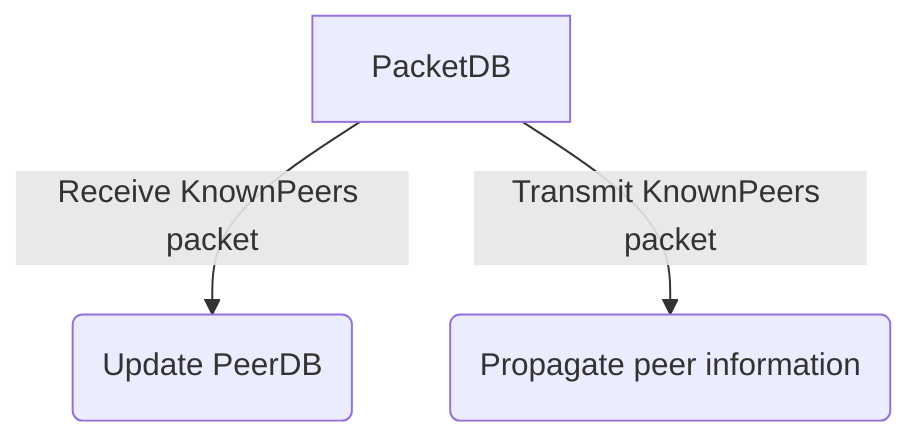

import { Callout, Steps, Step } from "nextra-theme-docs";

# Packet DB

The Packet DB is responsible for handling incoming and outgoing peer-to-peer packets in Rakis. It serves as the central hub for all network communication, ensuring that packets are processed, validated, and transmitted across the various P2P networks supported by Rakis.

## Packet Processing

When a peer-to-peer packet is received from any of the connected networks, it is passed to the `PacketDB` for processing. The `PacketDB` performs several crucial tasks:

1. **Signature Verification**: Each incoming packet is signed by the sending peer using their private key. The `PacketDB` verifies the signature to ensure the packet's integrity and authenticity.

2. **Deduplication**: The `PacketDB` checks if the packet has already been received and processed. This prevents unnecessary duplication and ensures efficient storage and processing.

3. **Packet Validation**: Depending on the packet type, the `PacketDB` performs additional validation checks. For example, if the packet is an `InferenceRevealRequest`, the `PacketDB` checks if the request is valid and if the node is part of the specified quorum.

4. **Event Emission**: After validating the packet, the `PacketDB` emits events based on the packet type. These events are consumed by other components of Rakis, such as the [InferenceDB](/inference-db) and the [QuorumDB](/inference-db/inference-db-quorum-db).

<Callout>
The `PacketDB` acts as a centralized hub for all incoming and outgoing packets, ensuring that packets are properly validated, deduplicated, and routed to the appropriate components within Rakis.
</Callout>

## Packet Transmission

In addition to processing incoming packets, the `PacketDB` is responsible for transmitting packets across the connected P2P networks. When a component within Rakis needs to send a packet, it calls the `transmitPacket` method of the `PacketDB`.

<Steps>

### Step 1

The `PacketDB` signs the packet using the node's private key, ensuring the packet's authenticity and integrity.

### Step 2

The signed packet is stored in the `PacketDB` for future reference and deduplication.

### Step 3

The `PacketDB` broadcasts the packet across all connected P2P networks, leveraging the redundancy provided by the multiple networks to ensure reliable delivery.

</Steps>

<Callout>
By broadcasting packets across multiple P2P networks, Rakis increases the likelihood of successful packet delivery, even in the face of network disruptions or failures.
</Callout>

## Peer List Management

The `PacketDB` plays a crucial role in managing the list of known peers in the network. It does this by processing `KnownPeers` packets, which contain information about peers discovered by other nodes.

When a `KnownPeers` packet is received, the `PacketDB` updates the [PeerDB](/peer-db) with the new peer information. This includes details such as the peer's synthientId (public key), chain identities, and the networks they were seen on.

Additionally, the `PacketDB` periodically transmits its own `KnownPeers` packet, which contains information about the peers it has discovered. This helps propagate peer information throughout the network, ensuring that all nodes have a comprehensive view of the active participants.

By managing and sharing peer information, the `PacketDB` contributes to the decentralized nature of Rakis, enabling nodes to discover and communicate with each other without relying on a central authority.