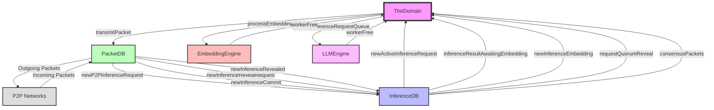

import { Callout, Steps, Step } from "nextra-theme-docs";

# Connections and Event Flow

In [The Domain](/the-domain), the various components work together through a series of connections and event flows. The core components involved are:

- [TheDomain](/the-domain) class
- [PacketDB](/packet-db)
- [InferenceDB](/inference-db)
- [EmbeddingEngine](/embedding-engine)
- [LLMEngine](/llm-engine)

<Callout>
  These components communicate through events, callbacks, and direct method
  invocations. Understanding their connections and the flow of data is crucial
  for comprehending the overall architecture and functionality of Rakis.
</Callout>

## Peer-to-Peer Packet Flow

The [PacketDB](/packet-db) is responsible for handling incoming and outgoing peer-to-peer packets. It receives packets from the configured P2P networks and emits events for different packet types. These events are consumed by other components, such as the [InferenceDB](/inference-db).

Here's how the packet flow works:

<Steps>

### Step 1

For each enabled P2P network instance, [TheDomain](/the-domain) sets up a listener for incoming packets using the `listenForPacket` method provided by the P2P network instance.

```typescript
for (const p2pNetwork of this.p2pNetworkInstances) {
  const listener = p2pNetwork.listenForPacket(async (packet) => {
    this.packetDB.receivePacket(packet);
  });

  // Add listener to shutdown listeners
  this.shutdownListeners.push(() => listener());
}
```

### Step 2

When the [PacketDB](/packet-db) receives a packet, it performs various operations, such as verifying the packet signature, deduplicating packets, and emitting events based on the packet type.

```typescript
packetDB.on("newP2PInferenceRequest", (packet) => {
  // Process the packet
});

packetDB.on("newInferenceCommit", (packet) => {
  // Process the packet
});

// ... and more event handlers for different packet types
```

### Step 3

The [InferenceDB](/inference-db) listens for these events and processes the packets accordingly. For example, it may store new inference requests or process inference commits.

```typescript
inferenceDB.on("newInferenceRequest", (request) => {
  // Save the inference request
});

inferenceDB.on("newInferenceCommit", (packet) => {
  // Process the inference commit
});
```

</Steps>

## Inference and Consensus Flow

The [InferenceDB](/inference-db) manages the lifecycle of inference requests, including the consensus process. It emits various events that are consumed by other components, such as the [EmbeddingEngine](/embedding-engine) and the [LLMEngine](/llm-engine).

Here's a simplified flow of events related to inference and consensus:

<Steps>

### Step 1

When a new inference request is received, the [InferenceDB](/inference-db) emits the `newActiveInferenceRequest` event, which triggers the processing of the inference request queue in [TheDomain](/the-domain).

```typescript
inferenceDB.on("newActiveInferenceRequest", (request) => {
  setTimeout(() => this.processInferenceRequestQueue(), 0);
});
```

### Step 2

The [LLMEngine](/llm-engine) listens for the `workerFree` event, which is emitted when an LLM worker becomes available. This triggers the processing of the inference request queue.

```typescript
llmEngine.on("workerFree", () => {
  setTimeout(() => this.processInferenceRequestQueue(), 0);
});
```

### Step 3

When an inference result is obtained, the [InferenceDB](/inference-db) emits the `inferenceResultAwaitingEmbedding` event, which triggers the embedding process in [TheDomain](/the-domain).

```typescript
inferenceDB.on("inferenceResultAwaitingEmbedding", (request, result) => {
  this.inferenceStatus.embeddingQueue.push({
    model: request.payload.securityFrame.embeddingModel,
    expiresAt: request.endingAt,
    request: {
      type: "resultEmbedding",
      request,
      result,
    },
    queued: false,
  });
  setTimeout(() => this.processEmbeddingQueue(), 0);
});
```

### Step 4

The [EmbeddingEngine](/embedding-engine) listens for the `workerFree` event, which is emitted when an embedding worker becomes available. This triggers the processing of the embedding queue.

```typescript
embeddingEngine.on("workerFree", () => {
  setTimeout(() => this.processEmbeddingQueue(), 0);
});
```

### Step 5

After the embeddings are computed, the [InferenceDB](/inference-db) emits the `newInferenceEmbedding` event, which triggers the propagation of the inference commit packet to the P2P networks.

```typescript
inferenceDB.on("newInferenceEmbedding", (embedding) => {
  // Propagate the inference commit packet
});
```

### Step 6

The [InferenceDB](/inference-db) also listens for events related to the consensus process, such as `requestQuorumReveal` and `consensusPackets`, and handles the corresponding actions.

```typescript
inferenceDB.quorumDb.on("requestReveal", (quorums) => {
  // Emit reveal requests
});

inferenceDB.quorumDb.on("consensusPackets", (packets) => {
  // Propagate consensus packets
});
```

</Steps>

This event-driven architecture allows for loose coupling between components and facilitates the flow of data and events throughout the system.

## Mermaid Diagram

Here's a mermaid diagram illustrating the connections and event flow between the core components of [The Domain](/the-domain):



In this diagram, [TheDomain](/the-domain) acts as the central component, managing the connections and event flows between the other components. The [PacketDB](/packet-db) handles the incoming and outgoing packets from the P2P networks and communicates with the [InferenceDB](/inference-db). The [InferenceDB](/inference-db) emits various events related to inference requests, embeddings, and consensus, which are consumed by [TheDomain](/the-domain), [EmbeddingEngine](/embedding-engine), and [LLMEngine](/llm-engine). The [EmbeddingEngine](/embedding-engine) and [LLMEngine](/llm-engine) emit worker-related events, which are consumed by [TheDomain](/the-domain) for managing the inference and embedding queues.
