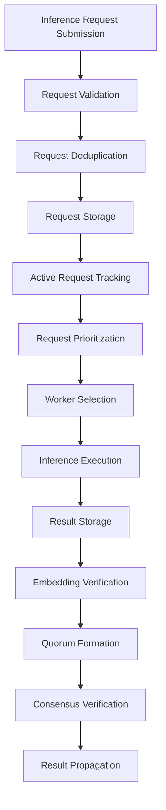

import { Callout, Steps, Step } from "nextra-theme-docs";

# Inference Request Lifecycle

The inference request lifecycle in Rakis is a critical process that governs how inference requests are initiated, processed, and ultimately resolved. This section will explore the various stages an inference request goes through, from its initial submission to the final consensus and result propagation.

<Callout>
The inference request lifecycle is tightly coupled with the [Distributed Consensus](/distributed-consensus) process, as inference requests are the starting point for achieving consensus on the inferred output.
</Callout>

## Request Submission

Inference requests can be submitted to the Rakis network in two ways:

1. **On-Chain Requests**: These requests originate from transactions on supported blockchains (e.g., Ethereum, Polygon, Arbitrum). The request payload is extracted from the transaction data and processed by the network.

2. **Peer-to-Peer Requests**: For testing and development purposes, inference requests can be directly broadcast to the peer-to-peer network using the appropriate packet type (`p2pInferenceRequest`).

<Callout>
While on-chain requests are the primary mode of operation for production use, peer-to-peer requests provide a convenient way to test and experiment with the network without incurring transaction costs.
</Callout>

## Request Processing

Once an inference request is received by the network, it goes through the following stages:

<Steps>

### Step 1: Request Validation

The request payload is validated to ensure it conforms to the expected format and includes all required fields, such as the prompt, accepted models, temperature, maximum tokens, and security frame.

### Step 2: Request Deduplication

To prevent redundant processing, incoming requests are checked against existing requests in the [Inference DB](/inference-db). If a matching request already exists, the new request is discarded.

### Step 3: Request Storage

Valid requests are stored in the Inference DB, along with relevant metadata like the fetch time and expiration time (calculated from the security frame).

### Step 4: Active Request Tracking

Requests that are still within their expiration window are added to the list of active inference requests, which is monitored by [The Domain](/the-domain) for inference processing.

</Steps>

## Inference Processing

Active inference requests are processed by [The Domain](/the-domain) in the following manner:

<Steps>

### Step 1: Request Prioritization

Requests are prioritized based on their expiration time, with requests closer to expiration being processed first. Additionally, requests within a configurable time window are grouped and randomly selected to ensure fair processing.

### Step 2: Worker Selection

Based on the accepted models specified in the request, available workers from the [LLM Engine](/llm-engine) are selected to handle the inference task.

### Step 3: Inference Execution

The selected worker processes the inference request, generating the output text and embedding information.

### Step 4: Result Storage

The inference result, along with the associated embeddings, is stored in the Inference DB for further processing.

</Steps>

## Consensus and Result Propagation

After the inference result is obtained, the following steps are taken:

<Steps>

### Step 1: Embedding Verification

The [Embedding Engine](/embedding-engine) is tasked with verifying the embeddings for the inference result. This process is crucial for achieving consensus among peers.

### Step 2: Quorum Formation

Based on the security frame specified in the original request, a quorum of peers is formed to participate in the consensus process. Peers submit their commitments (hashed embeddings) and reveal their inferences and embeddings.

### Step 3: Consensus Verification

The [Quorum DB](/inference-db/inference-db-quorum-db) within the Inference DB manages the consensus verification process, ensuring that a sufficient number of peers agree on the final inference result.

### Step 4: Result Propagation

Once consensus is achieved, the final inference result is propagated to the peer-to-peer network, allowing other nodes to verify and accept the result.

</Steps>

Throughout the inference request lifecycle, various events and callbacks are triggered to facilitate communication between different components of Rakis, such as the [Inference DB](/inference-db), [Packet DB](/packet-db), and [Peer DB](/peer-db). This event-driven architecture ensures that the necessary data is propagated and processed in a timely and efficient manner.