import { Callout, Steps, Step } from "nextra-theme-docs";

# Inference Request Queue

The Inference Request Queue is a critical component of [The Domain](/the-domain) that manages and prioritizes incoming inference requests. It ensures efficient utilization of computational resources and maintains a smooth flow of inference tasks.

## Overview

When an inference request is received, either directly from the [Inference DB](/inference-db) or through the [Packet DB](/packet-db), it is added to the Inference Request Queue. This queue is then processed at regular intervals, with requests being dequeued and assigned to available [LLM workers](/llm-engine) for inference processing.

The queue is designed to handle and prioritize requests based on various factors, such as the time remaining until the request's deadline, the similarity between requests, and the availability of compatible LLM models and workers.

<Callout>
The Inference Request Queue plays a crucial role in ensuring that inference requests are processed in a timely and efficient manner, while also optimizing resource utilization and preventing overloading of the system.
</Callout>

## Request Processing

The processing of the Inference Request Queue is handled by the `processInferenceRequestQueue` function, which is debounced to improve performance and prevent unnecessary computations. This function is executed at regular intervals, as determined by the `inferenceRequestQueueDebounceMs` setting.

Here's a high-level overview of the request processing flow:

<Steps>

### Step 1

Retrieve available inference requests from the [Inference DB](/inference-db) that meet the following criteria:

- The request has not expired (i.e., `endingAt` is in the future)
- The request is not already being processed

### Step 2

Determine the required LLM models based on the `acceptedModels` property of each inference request.

### Step 3

Check the availability of LLM workers for the required models using the [LLM Engine](/llm-engine)'s `getWorkerAvailability` method.

### Step 4

Filter the available inference requests to include only those that can be processed by the available LLM workers.

### Step 5

If there are no available requests, exit the processing loop.

### Step 6

Sort the available requests based on their `endingAt` time, prioritizing requests with earlier deadlines.

### Step 7

Group similar requests based on the `requestSimilarityTimeWindowMs` setting, which determines the time window within which requests are considered similar.

### Step 8

Randomly select a request from the group of similar requests.

### Step 9

Mark the selected request as being processed by adding its `requestId` to the `inferenceIdsInProcess` array.

### Step 10

Transmit a `peerStatusUpdate` packet indicating that inference is in progress, along with the selected model name.

### Step 11

Initiate the inference process by invoking the [LLM Engine](/llm-engine)'s `runInferenceNonStreaming` method with the selected request and model.

### Step 12

Upon completion of the inference process, handle the result by:

- If successful, transmit a `peerStatusUpdate` packet with the inference completion status and tokens-per-second (TPS) metric.
- Save the inference result to the [Inference DB](/inference-db).

### Step 13

Remove the processed `requestId` from the `inferenceIdsInProcess` array.

### Step 14

Recursively call `processInferenceRequestQueue` to continue processing the queue.

</Steps>

## Request Prioritization

Prioritization of inference requests is achieved through a combination of techniques:

1. **Deadline-based Prioritization**: Requests with earlier `endingAt` times are prioritized over those with later deadlines.

2. **Request Similarity Detection**: Requests that are similar in terms of their creation time (within the `requestSimilarityTimeWindowMs` window) are grouped together. One request is then randomly selected from this group for processing. This helps maintain fairness and prevents starvation of similar requests.

3. **Model Availability**: Requests are filtered based on the availability of compatible LLM workers. Requests requiring models without available workers are temporarily skipped.

This prioritization strategy ensures that critical requests with tight deadlines are processed first, while also accounting for fairness and efficient resource utilization.

## Examples

Let's consider an example scenario where three inference requests are received within a short time window:

```mermaid
gantt
    title Inference Request Timeline
    dateFormat  HH:mm
    axisFormat %H:%M

    section Request 1
    Received     :09:00, 09:00, 1m
    Deadline     :09:10, 09:10, 1m

    section Request 2
    Received     :09:01, 09:01, 1m
    Deadline     :09:12, 09:12, 1m

    section Request 3
    Received     :09:02, 09:02, 1m
    Deadline     :09:08, 09:08, 1m
```

In this scenario, the Inference Request Queue would process Request 3 first, as it has the earliest deadline (`09:08`). Request 1 would be processed next, followed by Request 2.

However, if Request 1 and Request 2 are considered similar (based on the `requestSimilarityTimeWindowMs` setting), they would be grouped together, and one of them would be randomly selected for processing after Request 3.

<Callout>
The Inference Request Queue's prioritization strategy ensures that urgent requests are handled promptly, while also maintaining fairness and preventing starvation of similar requests.
</Callout>

## Performance Considerations

The performance of the Inference Request Queue is critical for maintaining a smooth inference processing pipeline. To optimize performance, the following techniques are employed:

- **Debouncing**: The `processInferenceRequestQueue` function is debounced using the `inferenceRequestQueueDebounceMs` setting. This prevents excessive computations and allows the system to batch and prioritize requests more efficiently.

- **Efficient Data Structures**: The `inferenceIdsInProcess` array is used to keep track of requests currently being processed. This allows for quick lookups and prevents duplicate processing of the same request.

- **Asynchronous Processing**: Inference processing is performed asynchronously, allowing the system to continue handling other tasks while inferences are being computed.

By employing these techniques, the Inference Request Queue can handle a high volume of inference requests while maintaining optimal performance and resource utilization.