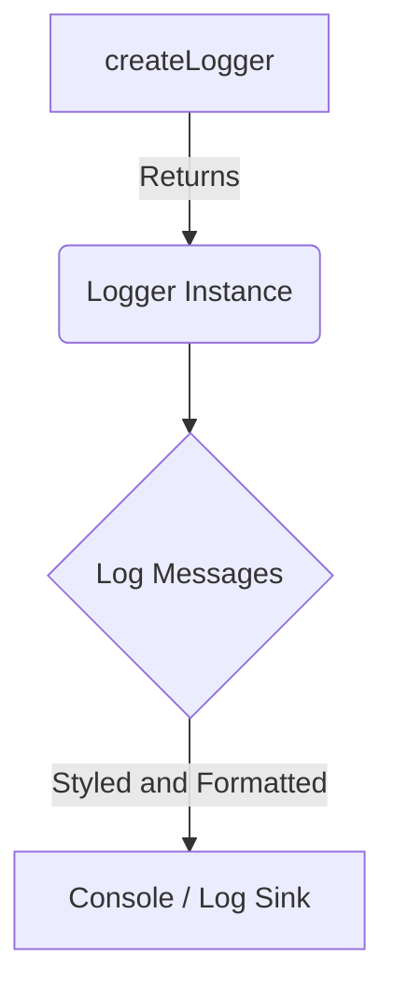

import { Callout, Steps, Step } from "nextra-theme-docs";

# Utilities

Rakis relies on various utility functions and helpers to ensure smooth operation and maintain a consistent codebase. This section covers the essential utilities used throughout the project, including cryptographic utilities, logging utilities, and miscellaneous helpers.

## Cryptographic Utilities

Cryptographic utilities play a crucial role in securing communication and ensuring data integrity within the Rakis network. These utilities are primarily used for signing and verifying packets, as well as managing identities and chain connections.

### Signing and Verifying Packets

Rakis employs a simple signing mechanism to ensure the authenticity and integrity of packets transmitted across the network. The `signJSONObject` function is responsible for signing a JSON object using a private key, while the `verifySignatureOnJSONObject` function verifies the signature against the provided public key and JSON object.

```typescript
// Sign a JSON object using a private key
const signature = signJSONObject(privateKey, jsonObject);

// Verify the signature against the public key and JSON object
const isValid = verifySignatureOnJSONObject(publicKey, signature, jsonObject);
```

<Callout>
These functions leverage the `ed25519` elliptic curve digital signature algorithm, which provides a balance between security and performance.
</Callout>

### Chain Identity Management

Rakis supports connections to various blockchain networks, and each user can associate their Synthient identity with one or more chain identities. The `verifyEthChainSignature` and `recoverEthChainAddressFromSignature` functions are used to verify and recover Ethereum-based chain identities, respectively.

```typescript
// Verify an Ethereum chain signature
const isValid = await verifyEthChainSignature(synthientId, signature);

// Recover the Ethereum address from a signature
const address = await recoverEthChainAddressFromSignature(synthientId, signature);
```

These functions leverage the `ethers.js` library to interact with Ethereum-based blockchains.

## Logging Utilities

Rakis employs a comprehensive logging system to facilitate debugging and monitoring. The `createLogger` function is used to create a logger instance for a specific context, with customizable log styles and an optional flag to enable logging to the console.

```typescript
const logger = createLogger("My Context", logStyles.myContext);
```

The `logStyles` object provides predefined log styles for various contexts within Rakis, ensuring consistent formatting and making it easier to identify the source of log messages.



Loggers can emit log messages using various severity levels, such as `debug`, `info`, `warn`, and `error`. Additionally, Rakis provides a `RetryQueue` utility class to handle retrying failed operations and logging the relevant information.

## Miscellaneous Helpers

Rakis includes a variety of miscellaneous helper functions and utilities to simplify common tasks and ensure consistent behavior across the codebase.

### Time and Date Utilities

The `stringifyDateWithOffset` function is used to convert a `Date` object to a string representation that includes the offset from UTC. This is particularly useful when dealing with timestamps and ensuring accurate time representation across different time zones.

```typescript
const dateString = stringifyDateWithOffset(new Date());
```

### Hashing and Encoding Utilities

Rakis provides several utilities for hashing and encoding data, such as `hashString`, `hashBinaryEmbedding`, and `quantize_embeddings`. These utilities are used in various contexts, such as computing binary embedding hashes and quantizing embeddings for efficient storage and transmission.

```typescript
// Hash a string
const hash = await hashString(inputString);

// Hash a binary embedding
const bEmbeddingHash = await hashBinaryEmbedding(binaryEmbedding);

// Quantize embeddings for efficient storage and transmission
const quantizedEmbeddings = quantize_embeddings(embeddings, 'ubinary');
```

### Random String Generation

The `generateRandomString` function is used to generate random strings of a specified length. This utility is handy for generating unique identifiers and ensuring randomness in various contexts, such as worker IDs or inference IDs.

```typescript
const randomString = generateRandomString(8);
```

### Debouncing and Throttling

Rakis employs debouncing and throttling techniques to control the rate of function execution and prevent overwhelming the system with too many concurrent operations. The `debounce` and `throttle` utilities provide a convenient way to apply these techniques to functions.

```typescript
// Debounce a function
const debouncedFunction = debounce(myFunction, 500);

// Throttle a function
const throttledFunction = throttle(myFunction, 1000);
```

These are particularly useful in scenarios where many events or operations need to be processed, such as handling incoming packets or processing inference requests.

These utilities allows Rakis to maintain a consistent and efficient codebase, ensuring secure communication, accurate logging, and streamlined operations.