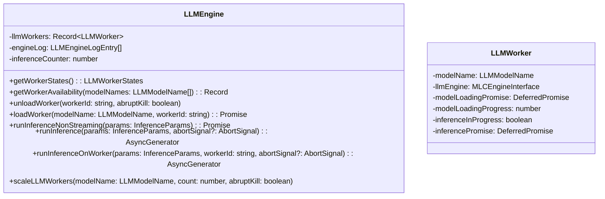
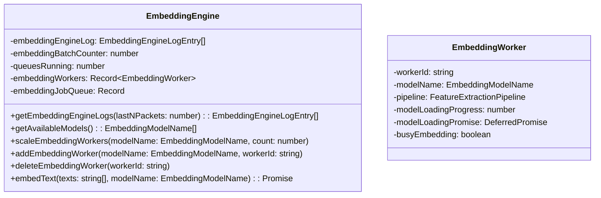
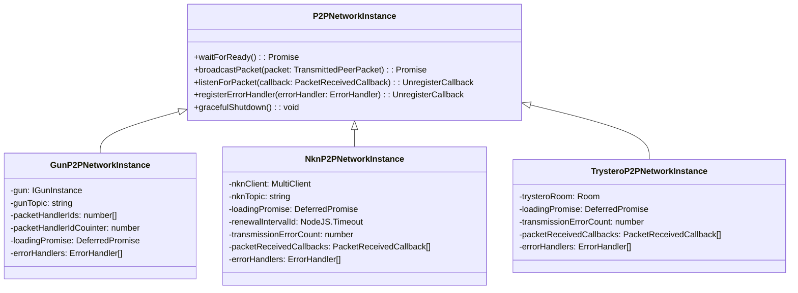

import { Callout, Steps, Step } from "nextra-theme-docs";

# Synthient Chain

The Synthient Chain is a key component of the Rakis architecture, comprising various modules responsible for managing peer identities, handling large language models (LLMs), computing embeddings, and facilitating peer-to-peer (P2P) communication.

## Identity Management

Rakis implements a unique identity system called "Synthients" to identify peers within the network. Each peer is assigned a public-private key pair, with the public key serving as the synthient ID.

<Callout>
The `synthientId` is a unique identifier representing a peer's public key on the Synthient network.
</Callout>

Peers can also associate their synthient ID with one or more blockchain addresses, thereby *Linking* their on-chain identities to their Rakis identity. This association is established by signing the synthient ID with the private key corresponding to the on-chain address, creating a `synthientIdSignature`.

```typescript
export type ChainIdentity = {
  chain: string; // e.g., "eth", "arbitrum", "solana"
  address: string; // The blockchain address
  synthientIdSignature: string; // Signature of the synthientId with the chain's private key
  signedWithWallet: string; // e.g., "metamask", "phantom"
};
```

Here's an example of how a peer can add a new chain identity to their Synthient:

<Steps>

### Step 1

Generate a signature by signing the `synthientId` with the private key corresponding to the desired blockchain address:

```javascript
const signature = await signer.signMessage(synthientId);
```

### Step 2

Call the `addChainIdentity` method on the `TheDomain` instance, providing the signature, chain identifier, and the wallet used for signing:

```javascript
const success = await theDomain.addChainIdentity(
  signature,
  "arbitrum", // Chain identifier
  "metamask" // Wallet used for signing
);
```

</Steps>

Upon successful verification, the new chain identity will be associated with the Synthient, allowing it to interact with the corresponding blockchain.

## LLM Engine

The LLM Engine is responsible for managing and executing large language models (LLMs) within the Rakis network. It supports loading multiple LLM models concurrently and provides an interface for running inference tasks on these models.



The `LLMEngine` class manages a pool of `LLMWorker` instances, each responsible for loading and executing a specific LLM model. Key features include:

- Loading and unloading LLM models dynamically
- Running inference tasks synchronously or as an asynchronous stream
- Scaling the number of workers for a given model up or down
- Logging and monitoring worker states and availability

To run an inference task, you can use the `runInferenceNonStreaming` method, which returns a `Promise` with the inference result:

```javascript
const inferenceResult = await llmEngine.runInferenceNonStreaming({
  modelName: "gemma-2b-it-q4f16_1",
  messages: [
    { role: "user", content: "What is the capital of France?" }
  ]
});
```

Alternatively, you can use the `runInference` method to stream the inference output:

```javascript
const inferenceStream = llmEngine.runInference({
  modelName: "gemma-2b-it-q4f16_1",
  messages: [
    { role: "user", content: "Write a short story about a robot" }
  ]
});

for await (const packet of inferenceStream) {
  if (packet.type === "token") {
    console.log(packet.token);
  }
}
```

## Embedding Engine

The Embedding Engine is responsible for computing embeddings for input text using pre-trained embedding models. It supports loading multiple embedding models concurrently and provides an interface for computing embeddings in batches.



The `EmbeddingEngine` manages a pool of `EmbeddingWorker` instances, each responsible for loading and executing a specific embedding model. Key features include:

- Loading and unloading embedding models dynamically
- Computing embeddings for a batch of input texts
- Scaling the number of workers for a given model up or down
- Logging and monitoring worker states and availability

To compute embeddings for a set of texts, you can use the `embedText` method:

```javascript
const texts = ["Hello, world!", "How are you doing today?"];
const embeddingResults = await embeddingEngine.embedText(texts, "nomic-ai/nomic-embed-text-v1.5");
```

The `embeddingResults` will contain an array of `EmbeddingResult` objects, each representing the embedding for a corresponding input text:

```typescript
type EmbeddingResult = {
  text: string;
  embedding: number[];
  binaryEmbedding: number[];
  bEmbeddingHash: string;
};
```

## P2P Networks

Rakis employs multiple P2P networks to facilitate communication and data exchange between peers. This redundancy ensures reliable message delivery and fault tolerance.



The `P2PNetworkInstance` class serves as a common interface for interacting with different P2P networks. It provides methods for broadcasting packets, listening for incoming packets, registering error handlers, and gracefully shutting down the network.

Rakis currently supports the following P2P networks:

- **GunDB** ([GunP2PNetworkInstance](/technical-architecture/layer-1-p2p-and-peering))
- **NKN** ([NknP2PNetworkInstance](/technical-architecture/layer-1-p2p-and-peering))
- **Trystero** (for Nostr and Torrent networks) ([TrysteroP2PNetworkInstance](/technical-architecture/layer-1-p2p-and-peering))

Each network implementation inherits from the `P2PNetworkInstance` class and provides its own implementation for connecting to the network, broadcasting messages, and handling incoming packets.

To broadcast a packet over all enabled P2P networks, you can use the `broadcastPacket` method provided by the `PacketDB` instance:

```javascript
const packet = {
  type: "inferenceCommit",
  bEmbeddingHash: "0x1234...",
  requestId: "request-123",
  inferenceId: "inference-456",
  createdAt: "2023-05-28T12:34:56Z"
};

await packetDB.transmitPacket(packet);
```

To listen for incoming packets, you can register a callback function with the `listenForPacket` method of the desired `P2PNetworkInstance`:

```javascript
const unregisterCallback = p2pNetworkInstance.listenForPacket((packet, peerInfo) => {
  console.log(`Received packet from ${peerInfo.peerId}: ${JSON.stringify(packet)}`);
});
```

The provided callback function will be invoked whenever a new packet is received from the network, passing the received packet and information about the peer that sent it.

By having multiple P2P networks, Rakis ensures reliable message delivery and fault tolerance, ensuring that the network can continue functioning even if one or more P2P networks experience issues.

[Next: Databases](/core-code-and-interfaces/databases)