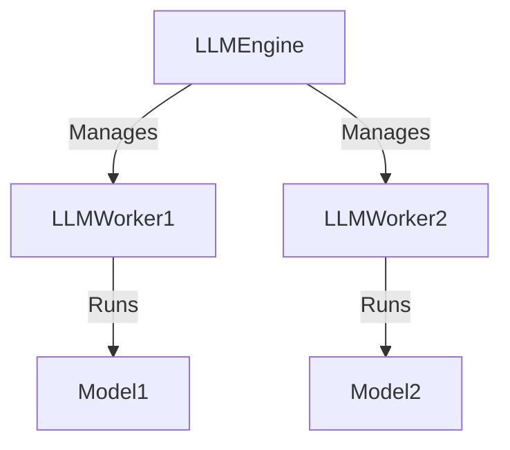
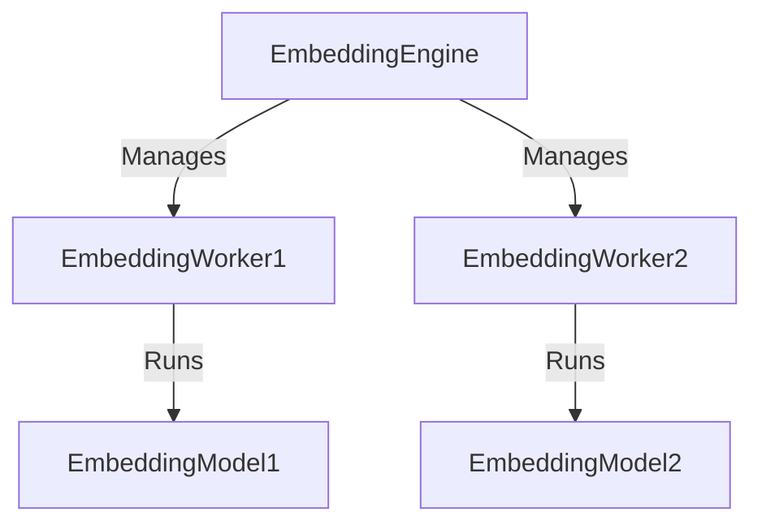

import { Callout, Steps, Step } from "nextra-theme-docs";

# Layer 2: Inference

In Rakis, the inference layer is responsible for managing the process of executing large AI models and handling inference requests. This layer consists of several key components that work together to handle the computationally intensive tasks involved in running AI models in a decentralized and distributed manner.

## Inference Requests

Inference requests are the driving force behind the inference layer. These requests originate from various sources, such as smart contracts, decentralized applications (dApps), or even directly from the Rakis network itself. An inference request typically contains the following information:

- **Prompt**: The input text or data that needs to be processed by the AI model.
- **Accepted Models**: A list of AI models that are compatible with the inference request. This allows the network to choose the most suitable model or models for the task.
- **Temperature**: A parameter that controls the randomness or creativity of the AI model's output.
- **Max Tokens**: The maximum number of tokens (words or subwords) that the AI model should generate in its output.
- **Security Frame**: A set of parameters that define the security and consensus requirements for the inference request. This includes the quorum size (number of nodes required to reach consensus), the maximum time allowed for the inference process, and the distance and percentage thresholds for determining consensus.

<Callout>
**Example Inference Request**

```json
{
  "prompt": "Summarize the key points of the Rakis project.",
  "acceptedModels": ["Llama-2-7b-chat-hf-q4f16_1", "Mistral-7B-Instruct-v0.2-q4f16_1"],
  "temperature": 0.7,
  "maxTokens": 150,
  "securityFrame": {
    "quorum": 5,
    "maxTimeMs": 60000,
    "secDistance": 0.2,
    "secPercentage": 0.8,
    "embeddingModel": "nomic-ai/nomic-embed-text-v1.5"
  }
}
```
</Callout>

## Inference Workers

Inference workers are responsible for executing the actual AI models and generating the inference results. Rakis supports multiple AI models, and these workers are responsible for managing the loading, unloading, and execution of these models.

The key components of the inference worker system are:

- **LLM Engine**: This component manages the lifecycle of the large language models (LLMs) used for inference. It handles the loading and unloading of models, as well as the scheduling and execution of inference requests on available workers.
- **LLM Workers**: These are individual workers that load and run specific AI models. Each worker is responsible for a single model and can handle multiple inference requests concurrently, subject to the available computational resources.



The LLM Engine is designed to scale the number of workers dynamically based on the demand for different models. It constantly monitors the availability of workers and adjusts their count accordingly, ensuring efficient resource utilization and minimizing idle workers.

## Embedding Workers

In addition to the inference workers, Rakis also employs embedding workers to handle the task of computing embeddings for the inference outputs. Embeddings are numerical representations of text that capture semantic meaning, making it easier to compare and cluster similar outputs.

The key components of the embedding worker system are:

- **Embedding Engine**: This component manages the lifecycle of the embedding models used to compute embeddings. It handles the loading and unloading of models, as well as the scheduling and execution of embedding requests on available workers.
- **Embedding Workers**: These are individual workers that load and run specific embedding models. Each worker is responsible for a single model and can handle multiple embedding requests concurrently, subject to the available computational resources.



The Embedding Engine, similar to the LLM Engine, dynamically scales the number of embedding workers based on the demand for different embedding models, ensuring efficient resource utilization.

## Queue Management

Due to the computationally intensive nature of AI models and the distributed nature of the Rakis network, efficient queue management is crucial for handling inference requests and embedding computations. Rakis employs several queuing mechanisms to ensure smooth operation and optimal resource utilization:

1. **Inference Request Queue**: This queue holds incoming inference requests that are waiting to be executed by available LLM workers. The queue is prioritized based on the expiration time of the requests, ensuring that time-sensitive requests are processed first.

2. **Embedding Queue**: This queue holds inference outputs that need to be embedded by the embedding workers. The queue is prioritized based on the expiration time of the requests, as well as the priority of the requests (e.g., consensus verifications before regular embeddings).

<Callout>
The queue management system in Rakis is designed to handle high volumes of inference requests and embedding computations, while ensuring that time-sensitive tasks are prioritized and resources are efficiently utilized.
</Callout>

## Model Selection

Rakis supports multiple AI models and embedding models, allowing users to choose the most suitable models for their inference requests. The model selection process is driven by the `acceptedModels` parameter in the inference request, which specifies the list of compatible models.

The selection of the appropriate model is based on several factors:

- **Model Availability**: The system checks the availability of workers for each accepted model and prioritizes models with available workers.
- **Model Performance**: Rakis may consider the performance characteristics of different models, such as inference speed, quality, and computational requirements, to select the most suitable model for the given inference request.
- **Load Balancing**: To ensure efficient utilization of resources, Rakis may distribute inference requests across multiple models, taking into account the current load on each model's workers.

<Steps>

### Step 1: Check Accepted Models

Rakis first inspects the list of accepted models specified in the inference request.

### Step 2: Determine Worker Availability

For each accepted model, Rakis checks the availability of workers that can run that model.

### Step 3: Select Suitable Model

Based on the worker availability, performance characteristics, and load balancing considerations, Rakis selects the most suitable model for the inference request.

### Step 4: Schedule Inference Request

The inference request is then scheduled to be executed on an available worker for the selected model.

</Steps>

By supporting multiple models and employing intelligent model selection, Rakis ensures that inference requests are processed efficiently while leveraging the strengths of different AI models.

<Callout>
**Example Model Selection**

Suppose an inference request specifies the following accepted models: `["Llama-2-7b-chat-hf-q4f16_1", "Mistral-7B-Instruct-v0.2-q4f16_1", "gemma-2b-it-q4f16_1"]`.

1. Rakis checks the availability of workers for each model.
2. It finds that there are 3 available workers for `Llama-2-7b-chat-hf-q4f16_1`, 1 available worker for `Mistral-7B-Instruct-v0.2-q4f16_1`, and 2 available workers for `gemma-2b-it-q4f16_1`.
3. Considering the current load on each model's workers and the performance characteristics, Rakis selects `Llama-2-7b-chat-hf-q4f16_1` for the inference request and assigns it to one of the available workers.
</Callout>

The inference layer in Rakis is designed to handle computationally intensive AI tasks in a decentralized and distributed manner, while ensuring efficient resource utilization, prioritization of time-sensitive requests, and intelligent model selection.