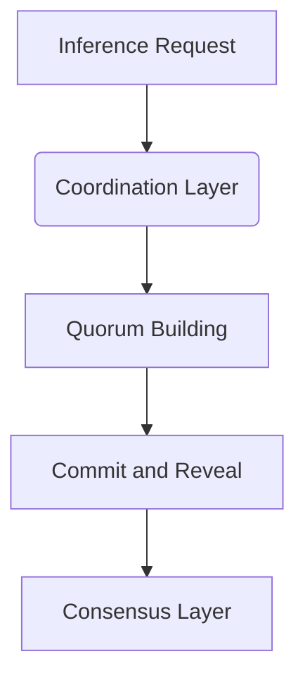

import { Callout, Steps, Step } from "nextra-theme-docs";

# Layer 3: Coordination

In the Rakis architecture, the coordination layer is responsible for managing the network events, handling the commit and reveal process, scheduling timeouts, and building quorums. This layer acts as a bridge between the peer-to-peer communication layer and the consensus layer, ensuring that the necessary steps are taken to reach agreement on inference results.

## Network Events and Requests

The coordination layer handles various network events and requests that are crucial for the decentralized inference process. These include:

- **Inference Requests**: When an inference request is received from a smart contract or a peer, the coordination layer initiates the process of gathering commitments from nodes participating in the inference.
- **Commit and Reveal**: The coordination layer manages the commit and reveal process, where nodes commit to their inference results without revealing them initially, and then reveal their results later in a controlled manner.

<Callout>
The commit and reveal process is a key component of the consensus mechanism, as it ensures that nodes cannot copy or influence each other's results before revealing them.
</Callout>

## Timeout-based Scheduling

Timeouts play a crucial role in the coordination layer, ensuring that the inference process progresses smoothly and does not get stuck in any particular state. The coordination layer implements the following timeout-based scheduling mechanisms:

<Steps>

### Step 1
**Commit Timeout**: After an inference request is received, nodes have a limited time window to submit their commitments (hashes of their inference results). If the required number of commitments is not received within this time frame, the inference request is considered failed.

### Step 2
**Reveal Timeout**: Once the commit timeout has passed and enough commitments have been received, nodes have another time window to reveal their actual inference results. If the required number of reveals is not received within this time frame, the inference request is considered failed.

### Step 3
**Consensus Timeout**: After the reveal timeout has passed and enough reveals have been received, the coordination layer initiates the consensus process. If the consensus process takes longer than a specified time frame, the inference request is considered failed.

</Steps>

These timeouts help ensure that the inference process does not stall indefinitely, allowing for efficient resource management and timely completion of inference requests.

## Quorum Building

The coordination layer is responsible for building quorums, which are subsets of nodes participating in a particular inference request. A quorum is formed based on the security parameters specified in the inference request, such as the required number of nodes and the acceptable level of divergence in inference results.

The quorum building process involves gathering commitments from nodes, verifying their validity, and selecting the appropriate nodes to participate in the consensus process. This helps ensure that the consensus process is efficient and secure, as it includes only the necessary nodes and excludes any potentially malicious or faulty nodes.

<Callout type="warning">
Building quorums is a critical step in the Rakis architecture, as it directly impacts the security and reliability of the inference results.
</Callout>

By managing network events, handling the commit and reveal process, implementing timeout-based scheduling, and building quorums, the coordination layer plays a pivotal role in the overall decentralized inference process. It also ensures that the necessary steps are taken to reach consensus on inference results in a secure and efficient manner.

For more information on the consensus mechanism and how it ties into the coordination layer, refer to the [Consensus Mechanism](/consensus-mechanism) section.