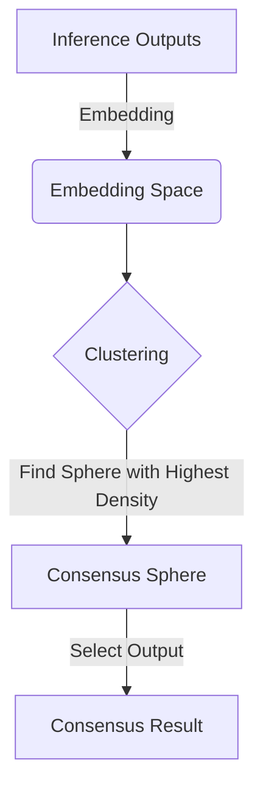

import { Callout, Steps, Step } from "nextra-theme-docs";

# Layer 4: Consensus

In the Rakis network, once inference requests have been processed and embeddings computed, the next step is to achieve at consensus on the results to arrive at **Verifiable Inference**. 

The consensus mechanism in Rakis is based on embeddings and a commit-reveal system. This approach allows for adjustable security bindings, enabling applications with varying security and determinism requirements to tailor the consensus process to their needs.

## Adjustable Security Bindings

Rakis implements an embedding-based consensus mechanism with a commit-reveal system. When an inference request is initiated, it specifies a security frame that determines the parameters for consensus. The security frame includes the following adjustable parameters:

- **Quorum Size**: The number of different nodes that need to run the inference within the specified time for it to be considered valid.
- **SecDistance**: The maximum distance in the embedding space within which results are considered similar.
- **SecPercentage**: The percentage of the quorum that needs to have results within the specified `SecDistance` for consensus to be achieved.

These parameters allow applications to balance security and determinism requirements with computational efficiency. For example, a simple creative project might specify a lower quorum size, a wider `SecDistance`, and a lower `SecPercentage`, while a financial application with higher security needs would do the opposite.

## Commit-Reveal System

The consensus process in Rakis follows a commit-reveal system. During the specified time window for inference, participating nodes exchange hashes that irreversibly represent their results. This is known as the commit phase and locks them into a certain result without being able to copy others.

<Callout>
The commit phase ensures that nodes cannot simply copy or modify their outputs based on what others have submitted, maintaining the integrity of the consensus process.
</Callout>

Once the commit phase ends, if there are enough commits, nodes form a quorum and request a reveal. During the reveal phase, all outputs are revealed and verified against the committed hashes. This is when the actual consensus computation takes place.

## Consensus Computation

The core of the consensus mechanism in Rakis involves embedding the inference outputs and performing clustering in the high-dimensional embedding space. The goal is to find the location of a sphere with radius `SecDistance` that encompasses the highest number of points (embeddings), as specified by the `SecPercentage` parameter.

Inference outputs outside this sphere are considered failing, and the rest are deterministically hashed to select a single output as the consensus result.

This approach leverages the properties of embedding spaces, where similar inputs tend to cluster together, while dissimilar inputs are separated by larger distances. By adjusting the security frame parameters, the consensus mechanism can accommodate different levels of precision and agreement required for the application.

<Callout type="warning">
It's important to note that the current implementation of the clustering algorithm is a basic $n^2$ solution. Future improvements may involve more advanced techniques like DBSCAN, OPTICS, or KNN to handle outliers and noise more effectively.
</Callout>

## Extensibility and Improvements

The consensus mechanism in Rakis is designed to be extensible and open to improvements. Some potential areas for future development include:

- Improved clustering algorithms: Implementing more advanced techniques like DBSCAN or OPTICS to better handle outliers and noise in the embedding space.
- Support for semi-structured output: Extending the consensus mechanism to combine exact matching in structured fields (e.g., booleans) with fuzzy comparisons for text outputs.
- Multiple embedding models: Allowing inference requests to specify multiple embedding models, leveraging the heterogeneity of models to make prompt-engineering and counter-ML attacks more challenging.
- Small model evaluators: Using tiny, constrained language models as evaluators to provide deterministic comparisons, which can then be combined using techniques like MapReduce to achieve consensus on larger lists of outputs.

By continuously improving the consensus mechanism, Rakis aims to provide a robust and reliable decentralized inference network that can adapt to diverse application requirements and security needs.